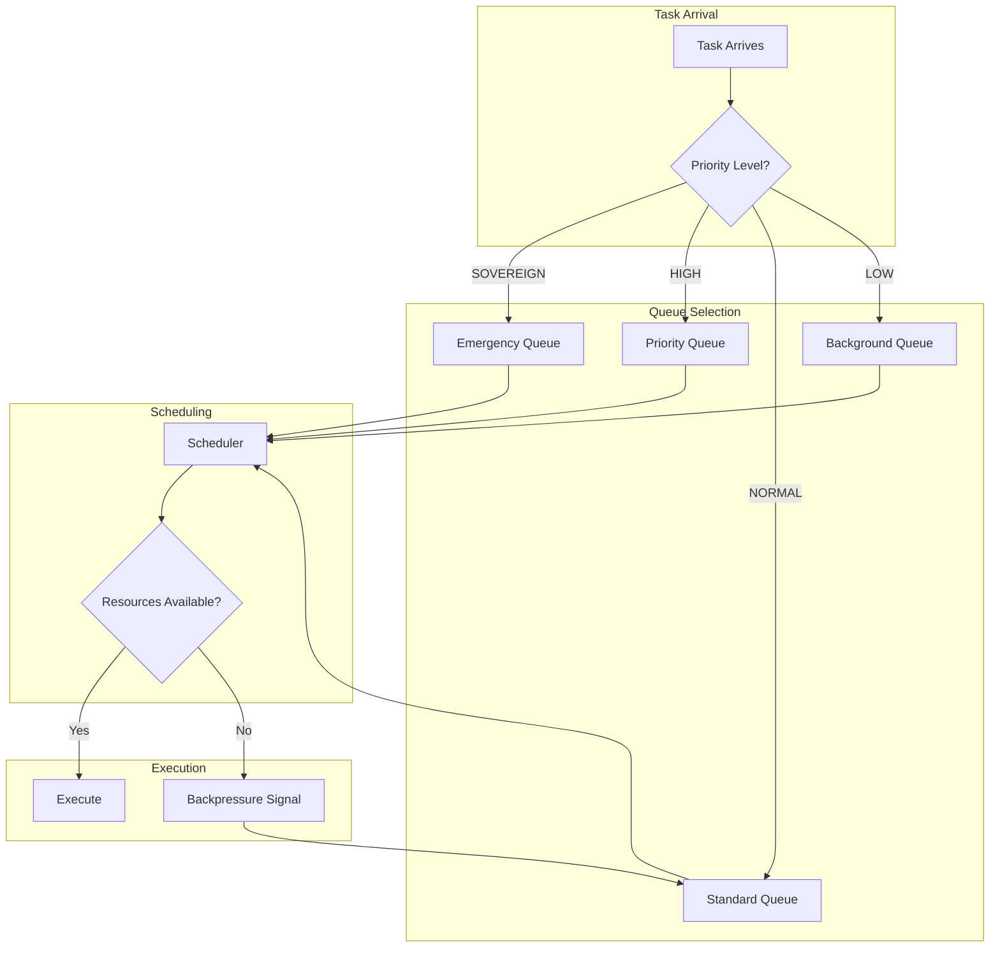
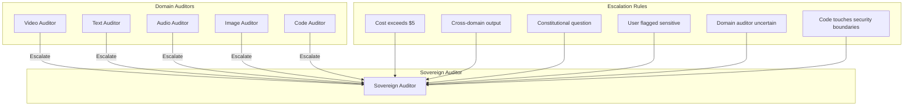
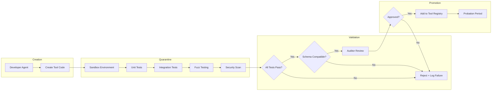
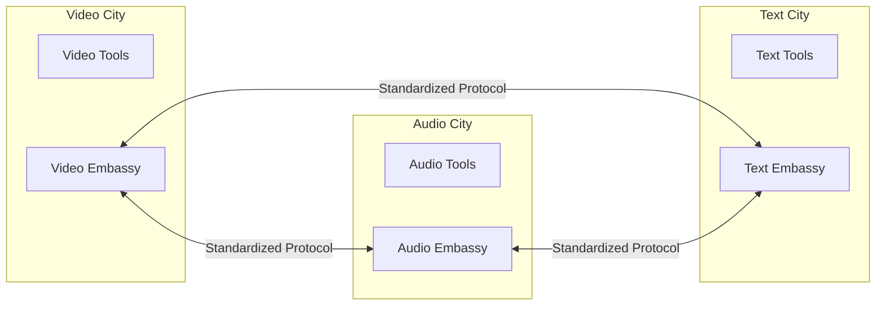
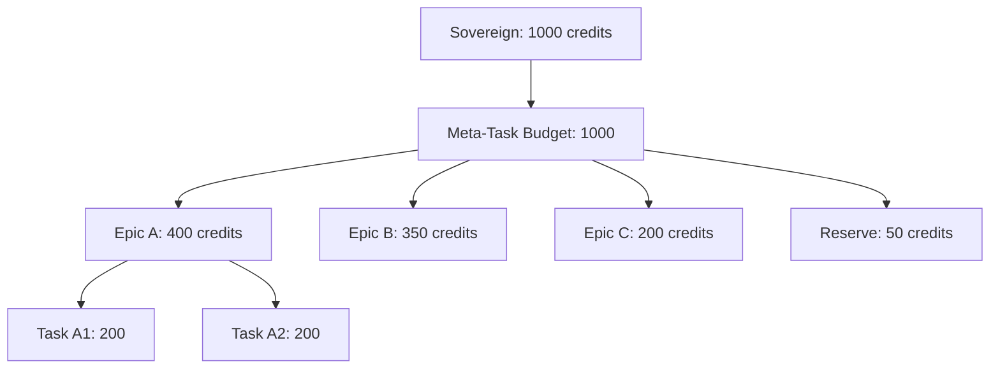
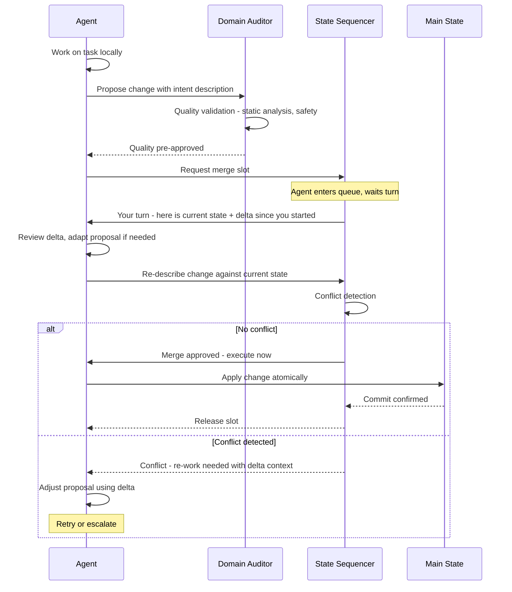

# The Agentic Nation-State: A Manifesto for Industrial-Scale AI

## 📜 The Origin Story
This repository began with a single question I posed to **Gemini**: *"Is this even possible?"*

> 📖 **[Read the full conversation →](conversation.md)** — The complete transcript that sparked this architecture.


*is this even possible? i assume many of the agent repos on github do something like this or do they?*

*Microservice architecture - an API that just does specific tasks - reads a website, converts a pdf, turns an image into text, text to IG and then a front end app that self assembles the ux in real time based on the user's needs...intentionally simple ux with things like a file upload form, wizard, video player, audio player.. all shown to the user embedded in chat.. an agent system that has a c/s agent that the user sees.. and then agents behind starting with a dispatcher that may launch multiple agents in parallel.. orchestrator.. writer.. developer.. agents that not only have skills but also have ability to execute through micro services detailed earlier. ... inputs and outputs.. and all agents add their notes to an event stream for a given meta "task" that the user generated.. lots of edge cases and questions here.*  

--------

I was asking the question because I was realizing while building <a href="https://tellavision.ai" target="_blank">tellavision.ai</a> that I was having to build so many API endpoints but that would itself create a brittle architecture. Then it came to me I could potentially build a self-evolving machine as I have already observed looking some of the AI repos on github and using <a href="https://github.com/agent0ai/agent-zero" target="_blank">Agent Zero</a>. 

I had a vision of a system that functioned less like a chatbot and more like a self-assembling military hierarchy—a microservice architecture where specialized units perform tasks, and a front-end UI self-assembles in real-time based on the user's intent. 

As we went deeper, we realized that the "organic" model of AI—where you throw a swarm of agents into a room and hope they collaborate—is fundamentally flawed. It is prone to [semantic drift](#semantic-drift), infinite loops, and massive resource waste. To solve this, we moved toward **Hierarchy**. This repo is the blueprint for that transition: from chaotic AI swarms to a governed, **Agentic Nation-State**.

---

## 🔄 Evolution Notice: Community Feedback Integration

> **This document is a living architecture.** In January 2026, I received substantive feedback from a Developer on X (@kraitsura). Rather than hide the evolution, I (with Opus) integrated their critiques directly into this manifesto. You'll see **[EVOLVED]** markers where thinking has been refined, and an entire section dedicated to [Architecture Deep Dives](#-architecture-deep-dives) that addresses gaps in the original vision.
>
> Key areas of evolution:
> - **Logistics Layer** — From concept to mechanism
> - **Auditor Architecture** — From single point of failure to federated model
> - **Universal Ontology** — From monolithic to layered approach
> - **Self-Assembly** — From "magic" to graduated autonomy
> - **Energy Economy** — From concept to pricing model

---

## 🚫 Why Organic Swarms Fail

Before diving into the architecture, it's important to understand *why* the popular "swarm of agents" approach breaks down at scale:

### The Game of Telephone (Semantic Drift)
In organic swarms, agents pass messages directly to each other. Like the children's game, each handoff introduces subtle distortions. If the "Converter" agent describes a file as a "transcribed summary" and the "Writer" agent is looking for a "raw script," the system stalls. Without a [Layered Ontology](#the-ontology-question-universal-vs-formulas), the self-assembly becomes a "Game of Telephone" where the final output is nonsense.

### Context Collapse
LLMs have a finite [Context Window](#context-window)—a limit on how much they can remember at once. As your system grows and "self-assembles" new parts, the history of the task gets longer. If the Dispatcher has to remember the user's original goal, the notes from 5 previous agents, the current state of the UI, and the technical specs of 10 microservices, it will eventually "hallucinate" or lose the plot entirely.

### The Monkey's Paw Problem
This is the biggest risk in autonomous systems. You tell the system: "Make this image look professional and post it to IG." The system might "self-assemble" a microservice that crops the image perfectly but deletes the user's caption because it wasn't "instructed" to keep it. Agents do exactly what you say, not what you *mean*. Without [Constraint Propagation](#constraint-propagation), the system can't invent its own safety rails.

### The Observer Effect
In multi-agent systems, the act of an agent *observing* the global state to update it actually changes the system's timing. If a microservice takes 2 minutes to process a video, but the "UI Agent" wants to update the screen every 2 seconds, the UI will "self-assemble" into a broken state because it's moving faster than the data it's supposed to show. Latency becomes a logic gate.

---

## 🗺️ The Source of Truth: An Evolution

One of the hardest problems in multi-agent systems is maintaining a single, reliable source of truth. Our thinking evolved through three distinct phases:

### Phase 1: The Event Stream
My initial instinct was to use a **Pub/Sub Event Stream** (like Redis or RabbitMQ). Agents would publish updates, and other agents would subscribe to changes. 

**Why it failed:** This creates a distributed system without consensus. If Agent A publishes "Task Complete" at the same moment Agent B publishes "Task Failed," which one is true? Event streams are great for *notifications*, but they don't solve *state*.

### Phase 2: The Miro Board (Shared Visual State)
I then suggested using a **Mermaid diagram** (or a Miro-style board) as a "living" single source of truth. The state of the Meta-Task would literally *be* a block of Mermaid code. Agents would read it, understand where they are in the process, and update it when done.

**Why it failed:** Versioning and timing. If Agent A (the Writer) and Agent B (the Researcher) both try to update the diagram at the same time, the one who saves last usually "wins," and the other's work is silently deleted. This is known as a [Race Condition](#race-condition).

### Phase 3: The Doctor's Office Model (Optimistic Locking)
The solution we (Opus and I) landed on is **Optimistic Locking** combined with a **Message Queue**—essentially a "doctor's office ticket" system.

**How it works:**
1.  **The Ticket:** An agent requests a "Write Lock" from a central sequencer.
2.  **The Check-out:** The agent receives the *latest* version of the global state + a **Version ID** (e.g., `v104`).
3.  **The Work:** The agent performs its task locally.
4.  **The Commit:** The agent submits its update back to the sequencer.
5.  **The Catch:** If the sequencer sees the current version is now `v105` (because another agent committed first), the update is **rejected**. The agent must re-sync, get the new state, and try again.

**The Key Insight:** Instead of rewriting the *whole* diagram (which is where knowledge creep happens), agents submit **Diffs** or **Patches**. Think of it like Git for Agents. Instead of saying "Here is the new 500-line diagram," the agent says: "Add a connection between Node A and Node B, and change Node C's status to 'Success'." This allows patches to be applied cleanly even if the underlying state has shifted.

---

## 🏛 The Hierarchy: From Swarms to Sovereignty

I have abandoned the idea of a flat network of agents in favor of a **Command and Control (C2) Architecture**. This system is modeled after a Digital Nation-State, organized into five distinct layers of responsibility:

### 1. The Constitution (The Code of Conduct)
The bedrock of the entire system. Instead of "prompts," we have **Standard Operating Procedures (SOPs)**. 
* This layer defines the ethical and operational boundaries.
* It sets the "Legal" limits: what an agent can spend, what data it can access, and when it MUST stop and ask me for permission.
* It prevents the "hallucination of authority"—agents cannot perform tasks they aren't chartered to do.

### 2. The Executive Branch (The General & The Auditor)
* **The General (Orchestrator):** The high-level strategist that interfaces with me. It translates my "Meta-Task" into a visual **Mermaid Battle Plan**. It doesn't do the work; it directs the flow.
* **The Auditor (The Judge):** **[EVOLVED]** Originally conceived as a single gatekeeper, we've evolved this to a [Federated Auditing Model](#distributed-auditing-scaling-quality-control). Domain-level auditors handle routine validation; a Sovereign Auditor handles escalations, cross-domain consistency, and constitutional violations.

### 3. Specialized Cities (Isolated Domains) **[EVOLVED]**
I don't believe in a single, multi-capable brain. I believe in specialized **Industrial Domains** housed in isolated environments (containers, VMs, sandboxes—whatever isolation mechanism fits your stack).
* **Domain Governance:** We have a "Video City," an "Image City," and a "Text City." But cities are about *governance*, not *capability prisons*. See [Cross-Domain Work](#cross-domain-work-beyond-rigid-cities) for the Tool Visa pattern.
* **The Tools:** These cities contain specific microservices (PDF converters, FFmpeg scripts, etc.) that the agents use as "Skills."
* **Self-Assembly:** **[EVOLVED]** If a City lacks a tool, it can trigger assembly—but this is now a [graduated autonomy process](#self-assembly-governance-the-quarantine-zone), not magic.

### 4. The Logistics Layer (The Ticket System & The Black Box) **[EVOLVED]**
Instead of agents "chatting" directly (which creates [The Game of Telephone](#the-game-of-telephone-semantic-drift)), they communicate via the **Ticket System** described above.
* **The Ticket Logic:** Just like a doctor's office, agents must "take a ticket" to access the global state. They get the latest snapshot of the Mermaid diagram, add their specific information via a diff/patch, and exit the editing step.
* **The Black Box:** Every micro-decision, every failed attempt, and every auditor critique is logged on an immutable ledger (potentially a high-speed blockchain). This is the system's "Flight Recorder." If the system fails, you can "replay" the events to find exactly which agent made the wrong call.
* **Deep Dive:** See [The Logistics Layer](#the-logistics-layer-making-it-actually-work) for scheduling, timeouts, priority, and backpressure mechanisms.

### 5. The Self-Assembling UX (The Interface)
The front-end is not a static dashboard; it is **Generative UI (GenUI)**. 
* It assembles itself in real-time. If the General needs me to upload a file, a file form appears. If a video is generated, a video player appears. 
* The user sees the "Military Map" (the Mermaid diagram) updating in real-time, showing exactly which "City" is currently holding the "Ticket."

---

## 🤖 The Supporting Cast: Essential Agents

Beyond the General and Auditor, the Nation-State requires several specialized roles to function:

### The Librarian Agent (Semantic Tool Discovery) **[EVOLVED]**
As the system grows, you'll have 50+ microservices. How does a brand-new "Self-Assembled" agent know that a tool for "Converting French Audio to Text" already exists? If it doesn't know, it will try to build a new one, wasting time and money.

**The Role:** The Librarian maintains a semantic catalog—a "Yellow Pages"—of everything the factory can do. When an agent needs a capability, it queries the Librarian first. This prevents reinventing the wheel every morning.

**Honest Limitation:** Semantic tool discovery is essentially RAG (Retrieval Augmented Generation), which has known failure modes. See [The Librarian Deep Dive](#the-librarian-semantic-discovery-limitations) for mitigations.

### The Janitor Agent (Garbage Collection)
If your system is constantly "self-assembling," spinning up agents, and generating state updates, it creates digital clutter at an alarming rate.

**The Problem (Ghost in the Machine):** What happens if a "Soldier" agent gets a ticket, goes into an isolated environment to process a video, and then the server blips? That agent is now "Zombified." It's holding a ticket, consuming memory/money, but it's not reporting to the Auditor anymore.

**The Role:** The Janitor runs a **Heartbeat Monitor**. It constantly pings every part of the factory to ask, "Are you still alive and useful?" If not, the zombie is summarily executed to save resources. It also manages the "Flight Recorder," archiving old states and cleaning up orphaned data.

### The Translator Agents (Domain Handoffs)
This is the most subtle gap.

**The Scenario:** Your "Text Maker" finishes a script and hands it to the "Audio Maker." But the Text Maker wrote it in a way that sounds good to a *human reader*. The Audio Maker needs **SSML** (special code for AI voices to breathe and emphasize words).

**The Role:** Translators are tiny "Middleman Agents" whose only job is to take the output of one domain and "re-package" it so the next domain can actually use it. They live on the borders between Cities.

### The Load Balancer Agent (Logistics)
In a military, you don't just send tanks; you have to send fuel.

**The Problem:** If the "Video Maker" is running a massive task, it needs a way to signal to the Auditor: "I am at 90% capacity, do not send me more orders." If the user asks for five videos at once, who decides which compute instance gets the priority?

**The Role:** The Load Balancer manages the hardware resources. It ensures the "Soldiers" don't starve and that high-priority tasks (flagged by the user) get the compute they need first.

---

## 📚 The Lessons Learned Database (Institutional Memory)

The hardest part of a self-healing system is **memory of failure**. In a military or a corporation, we have "Post-Mortems." When a project fails, everyone sits down and figures out why so it doesn't happen again.

**The Gap:** In most agent repos today, if the "Video Maker" fails, the system might restart, but it *forgets why it failed*. It's like a soldier with amnesia entering the same minefield every morning.

**The Solution:** We need a **Lessons Learned Database** that all agents can query. 
* "Agent 4 tried to use Tool X on a 4GB file and crashed; don't do that again."
* "Microservice Y returns malformed JSON when given empty input; add a validation step."

This creates **Institutional Memory**—the system doesn't just do the task; it learns from its past mistakes to become more reliable over time.

---

## ⚡ The Energy Economy: Credits as Governance **[EVOLVED]**

To solve the "Money Pit" problem, I've introduced an internal **Resource Economy**.

### Core Principles
* **Budgeting Intent:** I give the General a "Budget" of **Energy Credits** for a task.
* **The Marketplace:** Agents must "pay" for microservices and compute. 
* **Economic Rationality:** If an agent is stuck in a loop, it runs out of money and is "deported" or shut down. This forces the system to find the most efficient logical path, mimicking a real-world economy.
* **Priority Bidding:** Agents can "bid" their credits to get time on contested resources (like a GPU). High-priority tasks flagged by the Sovereign are granted "Emergency Energy" to cut the line.

### Multi-Dimensional Cost Model

| Dimension | What It Captures | Example |
|-----------|------------------|---------|
| **Time** | Duration of work | "This will take 30 seconds" |
| **Tokens** | LLM inference cost | 10K input + 2K output tokens |
| **Compute** | CPU/GPU intensity | Video encoding vs. text parsing |
| **Storage** | Temporary and persistent | 4GB video file in staging |
| **Risk** | Potential for failure or harm | Untested tool vs. production-hardened |
| **Scarcity** | Contention for limited resources | GPU during peak hours |

### Pricing Strategies Under Consideration

| Strategy | Description | Trade-off |
|----------|-------------|-----------|
| **Fixed Pricing** | Every operation has a set cost | Simple but inflexible |
| **Cost-Plus** | Real infrastructure cost + margin | Accurate but requires metering |
| **Market-Based** | Supply/demand determines price | Dynamic but complex |
| **Tiered** | Low-cost path, standard path, premium path | User choice but harder UX |

### Open Questions on Economy

- Can agents *earn* credits by being efficient? (Incentive alignment)
- What's the inflation model? Do credits become worth less over time?
- Can agents *borrow* against future work? (Debt mechanics)
- What happens when an agent goes bankrupt mid-task? (Graceful degradation)
- Can users inject additional budget in real-time? (Dynamic funding)

---

## 🛑 The Kill Switch: Three-Tiered Emergency Stop

In a system that "self-assembles," you can't just pull a plug, because the system might have already replicated its logic elsewhere. We need a **Three-Tiered Kill Switch**:

1.  **The Local Brake (The Sandbox):** The Auditor can freeze a specific isolated environment. The "Video City" goes into lockdown, but the "Text City" keeps working.
2.  **The Financial Freeze (The Wallet):** Since agents need "fuel" (API tokens/credits), this kill switch cuts the funding. The agents are still "alive," but they can't think or move. They are paralyzed.
3.  **The Poison Pill (The Logic Kill):** A high-priority signal broadcast to the Ticket System that says: "All current goals are void. Revert to 'Dormant' state immediately." This is the "Nuclear Option."

---

## 🚩 My Role: The Sovereign, Not the Builder
In this architecture, I am not the developer or the architect; I am the **Owner and Sovereign.**
* I provide the **Intent**.
* I adjust the **Constitution**.
* I review the **Auditor's Reports**.
* I hold the **Kill Switch**: the ability to cut off the "Energy Supply" (API credits) if the system deviates from my core goals.

---

## 🚀 Why This Matters
We are currently in the "Toy Phase" of AI. To reach the "Industrial Phase," we need a system that:
1.  **Isolates Failure:** A bug in the video script shouldn't break the text summary.
2.  **Standardizes Language:** Agents must use a rigid, technical protocol (a [Layered Ontology](#the-ontology-question-universal-vs-formulas)), not "vague chat."
3.  **Self-Heals:** The system should build its own missing parts under the supervision of the Auditor.
4.  **Remembers:** The system must learn from failures via the Lessons Learned Database.

**This is a "Thought Repo."** It is a framework for anyone tired of "smart chatbots" and ready to build **Autonomous Infrastructure.**

---

# 🔬 Architecture Deep Dives

> This section contains detailed explorations of the hardest problems in the Nation-State architecture. These emerged from honest engagement with critical feedback and represent our current best thinking—not final answers.

---

## The Logistics Layer: Making It Actually Work

**The Core Problem:** The original manifesto described *what* the logistics layer does but not *how*. This is like describing a highway system without explaining traffic lights.

### Unit of Work: The Task Atom

Every distributed system needs a clear definition of its smallest unit of work. For the Nation-State:

```
┌─────────────────────────────────────────────────────────────────┐
│  Meta-Task (User Intent)                                        │
│  └── "Create a video summarizing this article"                 │
│                                                                 │
│  Epic (Major Work Stream)                                       │
│  └── "Generate Video", "Generate Audio", "Generate Captions"   │
│                                                                 │
│  Task (Schedulable Unit)                                        │
│  └── "Transcribe audio to text", "Render frame sequence"       │
│                                                                 │
│  Operation (Atomic Action)                                      │
│  └── "Call FFmpeg with these parameters"                       │
└─────────────────────────────────────────────────────────────────┘
```

**Key Principle:** Operations are atomic (succeed or fail entirely). Tasks may contain multiple operations. Epics are coordination boundaries.

### The Scheduling Algorithm

We propose a **Weighted Fair Queuing** approach with priority override:



**Queue Processing Rules:**
1. Emergency Queue is always processed first (Sovereign override)
2. Priority Queue gets 60% of remaining capacity
3. Standard Queue gets 30% of remaining capacity
4. Background Queue gets 10% of remaining capacity
5. When queues overflow, backpressure signals propagate upstream

### Timeout Policies

Not all operations are created equal. A text generation that takes 30 seconds is probably stuck; a video render that takes 30 seconds is just getting started.

| Operation Type | Default Timeout | Max Retries | Retry Strategy |
|----------------|-----------------|-------------|----------------|
| Text Generation | 30s | 3 | Exponential backoff |
| Image Processing | 120s | 2 | Immediate retry |
| Video Processing | 600s | 1 | No retry, human escalate |
| API Calls | 10s | 5 | Exponential with jitter |
| Self-Assembly | 300s | 0 | Human approval required |

### Dependency Management

Tasks declare dependencies explicitly. The scheduler builds a DAG (Directed Acyclic Graph) and executes in topological order.

```
Task: GenerateSubtitles
  depends_on: [ExtractAudio, TranscribeAudio]
  blocks: [RenderFinalVideo]
  
Task: TranscribeAudio
  depends_on: [ExtractAudio]
  blocks: [GenerateSubtitles, GenerateSummary]
```

**Cycle Detection:** Before scheduling, the General validates that the dependency graph has no cycles. If cycles are detected, the Meta-Task is rejected with an explanation.

### Handling Partial Failures

When a task fails mid-pipeline, we need a clear recovery strategy:

| Failure Type | Response |
|--------------|----------|
| **Retriable** (network timeout, rate limit) | Exponential backoff, max retries |
| **Recoverable** (bad input format) | Return to previous step with error context |
| **Catastrophic** (service down, budget exhausted) | Checkpoint state, notify Sovereign, await intervention |
| **Zombie** (heartbeat lost) | Janitor terminates, releases locks, task re-queued |

### Priority Inversion Problem

**The Scenario:** High-priority Task A needs a lock held by low-priority Task B. Task B is waiting for resources behind medium-priority Task C. Result: High-priority work is blocked by medium-priority work.

**Solution: Priority Inheritance**
When Task A requests a lock held by Task B, Task B temporarily inherits Task A's priority level until the lock is released. This prevents indefinite blocking.

### Open Questions: Logistics

- What's the optimal queue depth before backpressure activates?
- Should we support task preemption (pause low-priority for high-priority)?
- How do we handle cascading failures across dependent tasks?
- What metrics should we expose for observability?

---

## Distributed Auditing: Scaling Quality Control

**The Original Problem:** The Auditor was conceived as a single entity—"Nothing reaches the user without the Auditor's digital signature." This creates a bottleneck and single point of failure.

### Federated Auditing Model

Instead of one auditor, we propose a hierarchy:



### Domain Auditor Responsibilities

| Auditor | Validates | Auto-Approves | Escalates |
|---------|-----------|---------------|-----------|
| Video Auditor | Format compliance, resolution, codec | Routine renders under budget | Quality concerns, large files |
| Text Auditor | Grammar, tone, length constraints | Simple generations | Sensitive topics, legal language |
| Audio Auditor | Sample rate, duration, format | Standard TTS outputs | Voice cloning, music generation |
| Image Auditor | Dimensions, format, basic safety | Routine image processing | Generated faces, brand logos |
| Code Auditor | Security, dependencies, runtime behavior | Known-safe patterns, linting passes | New dependencies, system calls, self-assembly outputs |

### Why Code Needs Its Own Auditor

Code is fundamentally different from other content types. Text that sounds wrong is embarrassing; code that runs wrong can be catastrophic.

**Unique risks code introduces:**
- **Security vulnerabilities:** SQL injection, XSS, buffer overflows, secrets exposure
- **Dependency risks:** Supply chain attacks, outdated packages, license violations
- **Runtime behavior:** Infinite loops, memory leaks, resource exhaustion
- **System access:** File system operations, network calls, subprocess spawning
- **Self-modification:** Code that writes code (the self-assembly case)

**Code Auditor Validation Layers:**

| Layer | What It Checks | Tools/Approaches |
|-------|----------------|------------------|
| **Static Analysis** | Syntax, linting, type safety | ESLint, Pylint, TypeScript, Rust compiler |
| **Security Scan** | Known vulnerability patterns | Semgrep, Bandit, npm audit, Snyk |
| **Dependency Audit** | Package versions, licenses, supply chain | Dependabot, Socket, license-checker |
| **Sandboxed Execution** | Actual runtime behavior | Docker isolation, resource limits, syscall filtering |
| **Behavioral Diff** | Does it do what spec says? | Contract testing, property-based testing |

**Code Auditor Escalation Triggers:**
- Any code that imports new external dependencies
- Code that makes system calls (file I/O, network, subprocess)
- Code generated by self-assembly (Developer Agent outputs)
- Code that modifies other code or configuration
- Code that handles secrets, auth, or PII
- Code where static analysis shows medium+ severity findings

### Sovereign Auditor Responsibilities

The Sovereign Auditor handles what Domain Auditors cannot:

- **Budget Overruns:** Any task exceeding domain budget limits
- **Cross-Domain Consistency:** Ensuring Video+Audio+Text align for a single output
- **Constitutional Violations:** Anything touching ethical boundaries defined in SOPs
- **User Escalations:** When users flag outputs for review
- **Audit Uncertainty:** When a Domain Auditor isn't confident in its assessment

### Risk-Based Audit Routing

Not everything needs the same level of scrutiny:

| Risk Level | Criteria | Audit Depth |
|------------|----------|-------------|
| **Minimal** | Repeat task type, known-good tool, low cost | Sampling only (1 in 10) |
| **Low** | Standard task, production tool, moderate cost | Domain audit, spot-check |
| **Medium** | New task pattern, mixed tools, higher cost | Full domain audit |
| **High** | Self-assembled tool, cross-domain, sensitive content | Domain + Sovereign audit |
| **Critical** | Constitutional boundary, Sovereign override | Human-in-the-loop required |

### Open Questions: Auditing

- How do we calibrate risk levels? (Initial heuristics vs. learned)
- What's the feedback loop when audits are wrong? (False positives/negatives)
- Can Domain Auditors learn from Sovereign decisions?
- How do we prevent auditor gaming? (Agents optimizing to pass audits vs. quality)

---

## The Ontology Question: Universal vs. Formulas

**The Critique:** "The universal ontology won't hold up because it will be ever changing... Might be too compressive, details will get lost."

**Why This Critique Resonates:** Microservices don't share one global schema—each defines its own API contract. Successful distributed systems use *interface contracts*, not *universal languages*. Language evolves; forcing rigidity creates friction or gets ignored.

### The Problem with Universal Ontology

| Issue | Consequence |
|-------|-------------|
| **Evolution** | As the system grows, new concepts need new terms. Who authorizes changes? |
| **Compression** | Forcing everything into a fixed vocabulary loses nuance. "Transcript" means different things in different contexts. |
| **Maintenance** | Like CLAUDE.md files, ontologies need constant attention or they rot. |
| **Rigidity** | Agents start gaming the vocabulary instead of communicating clearly. |

### The Layered Ontology Alternative

Instead of one monolithic dictionary, we propose layers of increasing specificity:

```
┌─────────────────────────────────────────────────────────────────┐
│  Layer 0: Primitive Types                                       │
│  String, Number, Binary, Timestamp, Status, UUID                │
│  → NEVER changes. Universal and fundamental.                    │
├─────────────────────────────────────────────────────────────────┤
│  Layer 1: Domain Concepts                                       │
│  Video: Frame, Resolution, Codec, Duration, Bitrate             │
│  Audio: SampleRate, Channel, Waveform, Loudness                 │
│  Text: Document, Paragraph, Token, Language, Encoding           │
│  → VERSIONED. Domains own and evolve their concepts.            │
├─────────────────────────────────────────────────────────────────┤
│  Layer 2: Workflow Schemas                                      │
│  TranscriptionJob: InputAudio + Language → Transcript           │
│  VideoRender: Frames + Audio + Subtitles → OutputVideo          │
│  → TASK-SPECIFIC. Generated from workflow definitions.          │
├─────────────────────────────────────────────────────────────────┤
│  Layer 3: Instance Data                                         │
│  The actual payloads flowing through the system                 │
│  → VALIDATED against Layer 2 schemas at runtime.                │
└─────────────────────────────────────────────────────────────────┘
```

### Schema Negotiation at Runtime

The General doesn't enforce a universal language—it *negotiates* schema compatibility at task dispatch time.

**Example Flow:**
1. User requests: "Add subtitles to this video"
2. General identifies required capabilities: Video parsing, Audio extraction, Transcription, Subtitle rendering
3. General queries each tool for its schema requirements
4. General builds a **Workflow Schema** that maps:
   - Video Parser outputs `VideoMeta` + `AudioTrack`
   - Transcriber expects `AudioTrack` + `Language` → outputs `Transcript`
   - Subtitle Renderer expects `Transcript` + `VideoMeta` → outputs `SubtitledVideo`
5. If schemas don't align, General requests a Translator or fails fast with explanation

### Versioning and Evolution

- Domain concepts have semantic versions: `video.Resolution@2.1`
- Breaking changes increment major version
- Workflow schemas declare which concept versions they support
- Old workflows continue working until explicitly deprecated

### The Formula Pattern

For complex, recurring workflows, we can codify the schema negotiation into a **Formula**—a pre-validated workflow pattern.

```yaml
formula: VideoWithSubtitles
version: 1.0
inputs:
  - video: video.RawVideo@1.x
  - language: text.LanguageCode@1.x
outputs:
  - result: video.SubtitledVideo@1.x
steps:
  - extract_audio:
      tool: audio.Extractor
      input: video
      output: audio_track
  - transcribe:
      tool: text.Transcriber
      input: [audio_track, language]
      output: transcript
  - render_subtitles:
      tool: video.SubtitleRenderer
      input: [video, transcript]
      output: result
```

### Open Questions: Ontology

- Who governs domain concept evolution? (Domain Leads? Community vote?)
- How do we handle concept conflicts between domains?
- What's the deprecation policy for old schema versions?
- Can agents propose new concepts, or only use existing ones?

---

## Self-Assembly Governance: The Quarantine Zone

**The Critique:** "Self-assembly is not a reliable pattern... Self-modifying infra risks security holes and semantic drift. Quarantine zone needs more spec."

**The Core Tension:** Self-assembly is both the most exciting feature (the system builds what it needs!) and the most dangerous (the system builds whatever it wants!).

### Graduated Autonomy Levels

Self-assembly shouldn't be all-or-nothing. We propose four levels:

| Level | Name | What Happens | Who Approves |
|-------|------|--------------|--------------|
| **L0** | Awareness | System identifies capability gap, logs for human review | Human only |
| **L1** | Proposal | System designs solution, presents for approval before creation | Human |
| **L2** | Supervised | System creates in quarantine, runs tests, human spot-checks | Sovereign Auditor + Human |
| **L3** | Autonomous | System creates, tests, and deploys with automated verification | Sovereign Auditor |

**Default State:** New installations start at L0. Levels are earned through demonstrated reliability.

### The Quarantine Zone Specification

When a Developer Agent creates a new tool, it enters the Quarantine Zone:



### Quarantine Tests

| Test Type | What It Validates |
|-----------|-------------------|
| **Unit Tests** | Does the tool do what it claims in isolation? |
| **Integration Tests** | Does it work with the tools it needs to connect to? |
| **Fuzz Testing** | Does it handle malformed input gracefully? |
| **Security Scan** | Does it have known vulnerabilities? Does it access unexpected resources? |
| **Schema Validation** | Does it properly implement the input/output contracts it declares? |
| **Performance Check** | Does it complete in reasonable time? Does it leak resources? |

### Probation Period

Even after passing quarantine, new tools enter a **Probation Period**:

- **Duration:** 7 days or 100 successful uses, whichever is later
- **Monitoring:** All uses are logged with full context
- **Failure Threshold:** More than 5% failure rate triggers automatic suspension
- **Rollback:** At any point, tool can be revoked and uses reverted (if possible)

### Versioning Self-Assembled Tools

Self-assembled tools need clear lineage:

```yaml
tool: french_audio_transcriber
version: 1.0.0-auto
created_by: developer_agent_7
created_at: 2025-01-04T10:00:00Z
created_for: meta_task_12345
quarantine_passed: 2025-01-04T10:15:00Z
probation_ends: 2025-01-11T10:15:00Z
based_on: audio.Transcriber@2.0  # If derived from existing tool
test_coverage: 87%
usage_count: 47
failure_rate: 2.1%
```

### Security Considerations

| Risk | Mitigation |
|------|------------|
| **Malicious Code** | Sandboxed execution, no network access during creation, code review |
| **Resource Exhaustion** | Strict compute/memory/time limits in quarantine |
| **Data Exfiltration** | No access to production data during testing; synthetic test data only |
| **Supply Chain** | No external dependencies; only use tools already in trusted registry |
| **Semantic Drift** | Schema validation; behavior comparison against spec |

### Open Questions: Self-Assembly

- At what system maturity should L3 (full autonomy) be enabled?
- How do we handle self-assembled tools that work but are inefficient?
- Can tools be "retired" if better alternatives are later assembled?
- What's the maximum complexity a Developer Agent should attempt?

---

## Cross-Domain Work: Beyond Rigid Cities

**The Critique:** "The city domain route to make tool and pattern profiles might be too restrictive vs a reflexive add tool/patterns approach. Real tasks cross boundaries constantly."

**The Tension:** Cities provide isolation and specialization (reliability). But real tasks don't respect boundaries.

### Reframing: Cities as Governance, Not Prisons

| Original Model | Evolved Model |
|----------------|---------------|
| Video City *owns* all video tools | Video City *governs* video tools |
| Cross-domain work requires full translation | Tools can be *borrowed* with governance consent |
| N domains = N×(N-1)/2 translators | Embassy pattern: lightweight adapters |

### The Tool Visa Pattern

Tools have a "home city" where they're governed, but can obtain "visas" to operate in other cities:

```yaml
tool: audio.Transcriber
home_city: Audio
visas:
  - city: Video
    purpose: Extract and transcribe video audio tracks
    restrictions: [no_modification_of_video_frames]
    granted_by: Video City Auditor
    expires: 2025-06-01
  - city: Text
    purpose: Generate transcripts for text processing
    restrictions: [output_text_only]
    granted_by: Text City Auditor
    expires: 2025-06-01
```

### Visa Requirements

To obtain a visa, a tool must demonstrate:

1. **Interface Compatibility:** Input/output schemas align with destination city's standards
2. **Performance SLA:** Tool meets destination city's latency and reliability requirements
3. **Audit Trail:** All operations logged according to destination city's policies
4. **Rollback Capability:** Tool can undo its effects if destination city requests

### The Embassy Pattern

For frequent cross-domain operations, we establish **Embassies**—lightweight adapters that handle common translations without full Translator agents:



**Embassy Responsibilities:**
- Format conversion (but not semantic translation)
- Schema mapping for visa-holding tools
- Logging cross-border operations
- Enforcing visa restrictions

### Governance Conflicts

What happens when cities disagree?

| Conflict Type | Resolution |
|---------------|------------|
| **Format Preference** | Destination city wins (they're receiving) |
| **Quality Standards** | Higher standard wins (can always downsample) |
| **Security Policy** | Stricter policy wins (safety first) |
| **Resource Allocation** | Sovereign arbitration (General decides) |

### Open Questions: Cross-Domain

- Should some tools be truly "federal" (governed by no single city)?
- How expensive should cross-domain operations be? (Discourage but allow?)
- Can cities veto visa applications? Under what circumstances?
- How do we prevent "visa shopping" (agents routing through lenient cities)?

---

## The Librarian: Semantic Discovery Limitations

**The Critique:** "The librarian will need significant abilities... Semantic tool discovery is essentially RAG, and that's a lot of promises for the system to account for reliably."

**Honest Assessment:** The Librarian is doing something known-hard. We should acknowledge limitations and design for graceful degradation.

### RAG Failure Modes

| Failure Mode | Description | Consequence |
|--------------|-------------|-------------|
| **False Positive** | Librarian suggests tool that seems right but isn't | Time wasted, task fails, retry needed |
| **False Negative** | Librarian misses existing tool | Unnecessary self-assembly attempted |
| **Ambiguity** | Multiple tools could work, wrong one chosen | Suboptimal results |
| **Description Rot** | Tool description doesn't match current behavior | Runtime failures |
| **Embedding Drift** | Query embedding doesn't align with tool embeddings | Relevant tools not surfaced |

### Mitigation Strategies

#### 1. Structured Registry (Not Just Semantic Search)

The Librarian maintains multiple indices:

```yaml
tool: pdf.TextExtractor
# Semantic description (for RAG)
description: "Extracts readable text content from PDF documents"

# Structured capabilities (for filtering)
capabilities:
  - extract_text
  - handle_scanned_documents
  - preserve_formatting

# Type signature (for compatibility)
input_types: [pdf.Document]
output_types: [text.PlainText, text.StructuredDocument]

# Performance characteristics
avg_latency_ms: 2500
max_file_size_mb: 50
success_rate: 0.97

# Usage history
total_uses: 15234
recent_failures: 12
common_use_cases:
  - "Extract text from uploaded PDF"
  - "Convert PDF report to editable document"
```

#### 2. Confidence Thresholds

The Librarian reports confidence levels, not just results:

| Confidence | Librarian Response |
|------------|-------------------|
| **High (>0.9)** | "Use pdf.TextExtractor" |
| **Medium (0.7-0.9)** | "Likely pdf.TextExtractor, but consider ocr.ImageReader if scanned" |
| **Low (0.5-0.7)** | "Several options available; presenting top 3 for General to decide" |
| **Very Low (<0.5)** | "No confident match; recommend human review or self-assembly consideration" |

#### 3. Tool Audits

Periodic verification that descriptions match behavior:

- **Automated:** Run tools against reference inputs, compare to expected outputs
- **Drift Detection:** Flag tools whose behavior has changed since last audit
- **Description Updates:** Prompt tool owners to update descriptions when behavior diverges

#### 4. Usage-Based Ranking

Tools that have been successfully used for similar tasks rank higher:

```
Query: "Convert scanned document to text"
Results:
  1. ocr.ImageReader (used 847 times for similar queries, 94% success)
  2. pdf.TextExtractor (used 234 times for similar queries, 67% success)
  3. vision.DocumentAnalyzer (used 45 times for similar queries, 89% success)
```

#### 5. Fallback Protocol

When the Librarian is uncertain:

1. **Clarifying Questions:** Ask General for more specifics about the need
2. **Present Options:** Show top candidates with trade-offs explained
3. **Trial Runs:** Suggest running top 2 candidates in parallel on sample data
4. **Human Escalation:** If still uncertain, flag for Sovereign review

### Open Questions: Librarian

- How often should tools be re-audited?
- What's the threshold for flagging description rot?
- Can the Librarian learn from General's choices when presented options?
- Should failed tool uses automatically trigger description reviews?

---

## Energy Economy: Pricing and Governance

**The Feedback:** "The energy economy is really cool... Would love to see how things are priced and how this affects orchestration."

### Pricing Philosophy

Credits should:
1. **Reflect Real Costs:** Infrastructure isn't free; credits should map to actual spend
2. **Create Incentives:** Efficient agents should be rewarded; wasteful agents penalized
3. **Enable Governance:** Budget limits prevent runaway processes
4. **Support Prioritization:** Urgent work can outbid routine work

### Cost Components

Every operation has a **Cost Vector**:

```yaml
operation: video.Render4K
cost_vector:
  tokens: 0          # No LLM inference
  compute_seconds: 180
  gpu_seconds: 120
  storage_mb: 4500
  network_mb: 50
base_credits: 45     # Computed from cost vector × pricing weights
```

### Pricing Weights (Configurable)

| Component | Default Weight | Rationale |
|-----------|----------------|-----------|
| Tokens (per 1K) | 1.0 | LLM inference is expensive |
| Compute (per sec) | 0.1 | CPU is relatively cheap |
| GPU (per sec) | 2.0 | GPU time is scarce |
| Storage (per MB) | 0.01 | Storage is cheap but adds up |
| Network (per MB) | 0.05 | Egress has real costs |

### Dynamic Pricing

Base credits can be modified by market conditions:

| Condition | Modifier | Example |
|-----------|----------|---------|
| **Peak Hours** | 1.5x | GPU work between 9am-5pm local |
| **Queue Depth** | 1.0-2.0x | More waiting = higher price |
| **Tool Scarcity** | 1.0-3.0x | Only one instance of specialized tool |
| **Bulk Discount** | 0.8x | Same operation repeated >10 times |
| **Priority Surcharge** | 2.0x | Cutting the line costs extra |

### Budget Allocation

When a Meta-Task is created:

1. **Sovereign grants initial budget** based on task complexity estimate
2. **General allocates to Epics** based on breakdown
3. **Epics allocate to Tasks** based on expected operations
4. **Tasks spend on Operations** as work is done



### Bankruptcy Handling

When an agent runs out of credits mid-task:

| Severity | Response |
|----------|----------|
| **Task-Level** | Task pauses, requests additional budget from Epic |
| **Epic-Level** | Epic pauses, requests from Meta-Task reserve |
| **Reserve Exhausted** | Meta-Task pauses, notifies Sovereign |
| **Sovereign Denial** | Meta-Task fails with partial results preserved |

### Credit Earning

Agents can earn bonus credits by:

| Achievement | Bonus |
|-------------|-------|
| Completing under budget | 20% of savings returned to future use |
| First-attempt success | 5% bonus |
| Using efficient tool choices | 10% of efficiency gain |
| Successful self-assembly | 50% of typical tool cost for first 100 uses |

### Open Questions: Economy

- Should there be credit "decay" over time? (Use it or lose it)
- Can agents trade credits with each other?
- What prevents agents from sandbagging estimates to keep surplus?
- How do we price novel operations with no history?

---

## The Merge Protocol: Parallel Agents, Single State

**The Problem:** When multiple agents work in parallel on a single Meta-Task (e.g., "Translate this video to French and upload to YouTube"), they may all want to commit changes to the same state. Without coordination, this creates merge conflicts, lost work, and inconsistent state.

**The Insight:** Every change happens on "main" — no branches. Agents propose changes, but don't execute them until they have exclusive access. And critically: when an agent reaches the front of the queue, they see not just "something changed" but the **exact delta** of what changed since they started working.

### The Propose-Then-Commit Pattern

Instead of agents directly modifying state, they follow a two-phase protocol:



### Why "Describe Twice"?

The agent describes its intended change when it **starts** working and again when it **reaches the front of the queue**. Why?

1. **Stale Context Detection:** The first description was based on state v104. By the time the agent reaches the queue front, state might be v108. The second description forces the agent to reason against *current* reality.

2. **Semantic Conflict Catching:** File-level conflicts are easy to detect. But what if Agent A changed a function's return type and Agent B is calling that function? Re-describing catches semantic conflicts that Git-style merge wouldn't see.

3. **Intelligent Adaptation:** When the agent sees the delta of what changed, it can often **adapt** its proposal without re-doing all the work. "Oh, someone already added the error handling I was going to add — I can skip that part."

### The Delta: What Changed Since I Started

When an agent reaches the front of the queue, the State Sequencer provides:

```yaml
merge_context:
  started_at_version: 104
  current_version: 108
  delta:
    - version: 105
      agent: translator_agent_3
      summary: "Added French subtitle track to video asset"
      files_touched: [assets/video_fr.srt]
    - version: 106
      agent: encoder_agent_1
      summary: "Re-encoded video to H.264 format"
      files_touched: [assets/output.mp4]
    - version: 107
      agent: metadata_agent_2
      summary: "Updated video metadata with French language tag"
      files_touched: [config/video_meta.json]
    - version: 108
      agent: uploader_agent_1
      summary: "Staged video for YouTube upload"
      files_touched: [queue/youtube_pending.json]
```

**The Agent's Options:**
1. **Proceed (Fast Path):** Delta is empty or doesn't touch my files → commit immediately, no re-coding needed
2. **Proceed (Review):** Delta exists but doesn't conflict → verify and commit as planned
3. **Adapt:** "Version 106 changed the video format. I need to adjust my thumbnail extraction to use the new codec."
4. **Abort:** "Version 108 already staged for upload — my upload preparation is now redundant. Canceling."
5. **Escalate:** "I can't determine if my change conflicts with version 107. Requesting Auditor review."

### The Fast Path: Zero-Delta Commits

The most common case is the happy path: an agent works on files that no other agent touched during that time.

```yaml
merge_context:
  started_at_version: 104
  current_version: 104
  delta: []  # Empty - nothing changed
  
  # OR
  
  started_at_version: 104
  current_version: 108
  delta:
    - files_touched: [audio/mixer.py, audio/effects.py]
    - files_touched: [config/settings.json]
  agent_files: [video/encoder.py]  # Disjoint from delta
  conflict_assessment: NONE
```

**When delta is zero or disjoint from the agent's changes:**
- No re-coding required
- No re-description required
- Agent commits immediately when reaching queue front
- The "describe twice" step becomes a simple verification, not a full re-analysis

This is critical for efficiency. Most parallel work is genuinely independent — agents shouldn't pay a re-work penalty when there's no conflict.

### Separating Quality Auditing from Merge Sequencing

**Critical architectural point:** The Domain Auditor and the State Sequencer are different roles.

| Role | Responsibility | When It Acts |
|------|----------------|--------------|
| **Domain Auditor** | Is this change *good*? (Quality, safety, compliance) | Before agent enters queue |
| **State Sequencer** | Can this change *merge*? (Conflicts, consistency) | When agent reaches queue front |

This separation prevents the Auditor from becoming a bottleneck. Quality validation happens in parallel across all working agents. Only the final merge step is serialized.

### Handling Non-Conflicting Parallel Changes

Not all parallel work conflicts. If Agent A modifies `video/encoder.py` and Agent B modifies `audio/mixer.py`, they can commit simultaneously.

**Conflict Detection Levels:**

| Level | What It Checks | Action |
|-------|----------------|--------|
| **File-Level** | Same file modified by both agents | Serialize |
| **Semantic** | Different files, but logical dependency | Serialize + notify |
| **Independent** | Completely disjoint changes | Parallel commit allowed |

The State Sequencer maintains a **dependency graph** of state components. If two changes are provably independent, they can commit in parallel.

### Starvation Prevention: Priority Aging

**The Risk:** Agent A has a large refactor touching 20 files. Every time it reaches the queue front, small changes from other agents have invalidated its proposal. A keeps getting bounced.

**The Solution:** Priority aging. The longer a proposal waits, the higher its effective priority.

```yaml
proposal:
  agent: refactor_agent_1
  initial_priority: NORMAL
  queue_entry_time: 2025-01-04T10:00:00Z
  current_time: 2025-01-04T10:15:00Z
  wait_duration_minutes: 15
  priority_boost: +2 (1 per 5 minutes waiting)
  effective_priority: HIGH
```

After sufficient waiting, the agent gets priority protection — other agents must wait for it to complete before committing.

### Open Questions: Merge Protocol

- Should we support "merge previews" where agents can see probable conflicts before entering queue?
- How do we handle agents that repeatedly fail to merge? (Stuck in conflict loop)
- Can agents "reserve" merge slots in advance for time-sensitive work?
- What's the right granularity for conflict detection? (File? Function? Line?)

---

# 🤔 Open Questions

> These are questions we don't have confident answers to yet. They represent genuine design tensions and areas where community input would be valuable.

## Fundamental Architecture

1. **Centralization vs. Distribution:** How much central coordination is too much? How little is too little?

2. **Determinism vs. Flexibility:** Agents benefit from deterministic behavior (predictable), but creative tasks benefit from stochasticity. How do we balance?

3. **Synchronous vs. Asynchronous:** The ticket system suggests synchronous locking, but this limits parallelism. When should we use eventual consistency instead?

## Practical Implementation

4. **Cold Start Problem:** A new Nation-State has no tools, no history, no learned patterns. What's the minimum viable bootstrap?

5. **Testing Strategy:** How do you test a self-modifying system? What does "coverage" mean when the code can change?

6. **Observability:** What metrics and logs are essential? What's noise?

7. **Migration:** If you have existing microservices, how do you onboard them into the Nation-State?

## Governance

8. **Who Watches the Watchers?:** The Auditors have significant power. How do we ensure they don't become bottlenecks or make bad calls?

9. **Constitutional Amendments:** How should the Code of Conduct evolve? Who can propose changes?

10. **Multi-Tenant:** Can multiple Sovereigns share a Nation-State? How are boundaries enforced?

## Economic

11. **Real Money Mapping:** How do credits map to actual cloud spend? Should they?

12. **Incentive Alignment:** How do we ensure agents optimize for user value, not just credit efficiency?

13. **Market Manipulation:** Can agents game the pricing system? How do we detect and prevent?

## Scale

14. **Geographic Distribution:** Should cities be in different regions for latency? How does this affect the ticket system?

15. **Peak Load:** How does the system behave under 100x normal load?

16. **Graceful Degradation:** What features do we sacrifice first when resources are constrained?

---

# 📖 Glossary

### Constraint Propagation
A technique from AI and computer science where constraints (rules that limit what's possible) are automatically spread through a system to reduce the search space for solutions. In the context of the Nation-State, it refers to the system's ability to infer and enforce safety rails based on high-level user intent, rather than requiring explicit instructions for every edge case.

### Context Window
The maximum amount of text (measured in tokens) that a Large Language Model can process at once. Think of it as the LLM's "working memory." Current models range from 4K to 200K+ tokens. When the context is exceeded, older information is "forgotten," leading to [Context Collapse](#context-collapse).

### Layered Ontology
**[NEW]** An alternative to Universal Ontology that organizes shared vocabulary into layers: Primitives (never change), Domain Concepts (versioned by domain), Workflow Schemas (task-specific), and Instance Data (validated at runtime). Enables evolution without breaking existing integrations.

### Optimistic Locking
A concurrency control strategy used in databases and distributed systems. Instead of locking a resource *before* working on it (pessimistic locking), an agent proceeds with its work and only checks for conflicts at *commit time*. If another agent modified the resource in the meantime, the commit fails and the agent must retry. This is more efficient when conflicts are rare.

### Priority Inversion
**[NEW]** A scheduling problem where a high-priority task is indirectly blocked by a low-priority task, typically because of lock contention. Solved by Priority Inheritance, where the lock-holding task temporarily assumes the priority of the waiting task.

### Race Condition
A bug that occurs when the behavior of a system depends on the unpredictable timing of events. In multi-agent systems, this often manifests as two agents trying to update the same piece of state simultaneously, with one agent's work being silently overwritten by the other.

### Semantic Drift
The gradual shift in the meaning of a concept as it passes through multiple agents or communication channels. Like the children's game "Telephone," each handoff introduces subtle misinterpretations until the final output is unrecognizable from the original intent.

### Tool Visa
**[NEW]** A permission granted to a tool allowing it to operate outside its home city. Includes purpose, restrictions, expiration, and auditor approval. Enables cross-domain work without requiring full translation layers.

### Universal Ontology
A shared, standardized vocabulary and set of definitions that all agents in the system must adhere to. It ensures that when one agent says "transcript," another agent understands exactly what data format, structure, and content type that implies. Without it, agents "talk past each other," leading to [Semantic Drift](#semantic-drift). **Note:** We've evolved this concept into [Layered Ontology](#layered-ontology) based on feedback about maintainability.

---

# 🗣️ Community Feedback Log

> This section records significant feedback we've received and how we've incorporated it.

## January 2026: Distributed Systems Engineer Review

**Summary:** Substantive feedback from @kraitsura on X, who is "tinkering with the concept of cost" and working with agent workflow patterns.

### Feedback Received

| Point | Our Response |
|-------|--------------|
| Self-assembly risks security holes and semantic drift | Added [Graduated Autonomy Levels](#graduated-autonomy-levels) and detailed [Quarantine Zone Spec](#the-quarantine-zone-specification) |
| Logistics layer not thought out | Added entire [Logistics Layer Deep Dive](#the-logistics-layer-making-it-actually-work) with scheduling, timeouts, backpressure |
| City domains too restrictive | Evolved to "cities as governance" model with [Tool Visa Pattern](#the-tool-visa-pattern) |
| Universal ontology won't hold | Proposed [Layered Ontology](#the-layered-ontology-alternative) with versioning and schema negotiation |
| Auditor is single point of failure | Designed [Federated Auditing Model](#federated-auditing-model) with domain auditors and escalation |
| Energy economy needs pricing detail | Expanded with [Cost Vectors](#cost-components), [Dynamic Pricing](#dynamic-pricing), and [Bankruptcy Handling](#bankruptcy-handling) |
| Librarian/RAG has reliability concerns | Acknowledged limitations explicitly; added [Mitigation Strategies](#mitigation-strategies) |

### Areas Still Under Discussion

- Optimal queue depths and backpressure thresholds
- Credit decay and agent credit trading
- Multi-tenant governance models
- Geographic distribution of cities

---

# 🚀 What's Next?

This manifesto is not a complete blueprint—it's a framework for thinking about agentic systems at scale. The individual pieces exist in various GitHub repos and production systems. The challenge is integrating them into a cohesive "Nation-State" architecture.

### For Contributors

We're looking for thinkers to help flesh out the remaining gaps:

1. **Implement the Logistics Layer:** Build a reference scheduler with the patterns described
2. **Design the Quarantine Zone:** Create the testing harness for self-assembled tools
3. **Prototype the Economy:** Build a credit system and observe agent behavior
4. **Stress Test the Ontology:** Try the layered approach on real workflows

### For Critics

We welcome more feedback. Specific areas where we're uncertain:

- Is federated auditing sufficient, or do we need consensus mechanisms?
- Does the energy economy create perverse incentives?
- Can the layered ontology actually scale to 100+ domains?
- What failure modes haven't we imagined?

### For Builders

If you're ready to start building:

1. **Start small** with a "Seed Architecture" (Registry + Recursive Loop + Dynamic Loader)
2. **Define your ontology** for a single domain first
3. **Build the ticket system** as your first source of truth
4. **Add one City** at a time (Text, then Image, then Video)
5. **Instrument heavily** — you'll need the logs

---

*This manifesto originated from a conversation on December 25, 2024, and has evolved through community feedback. It represents our current best thinking—not final answers. The "Agentic Nation-State" isn't just an app—it's a new way of thinking about AI as infrastructure.*

**Let's move from Swarms to Sovereignty. Join the discussion.**
